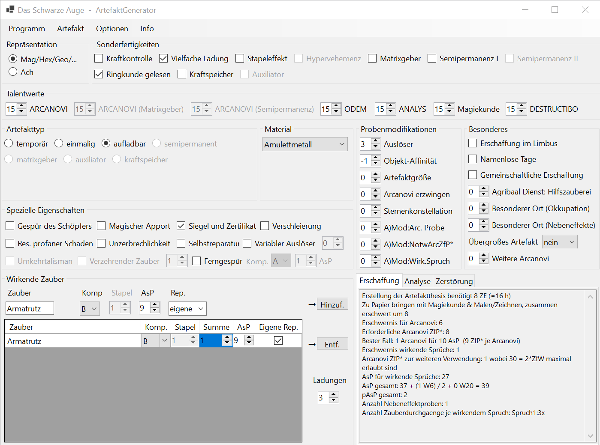

# DSA Artefaktgenerator

Der DSA Artefaktgenerator ist eine .NET 6.0 Windows Desktop Applikation (x86) und versucht die Regeln rund um die Erstellung magischer Artefakte im DSA 4.1 Regelsystem einfach nutzbar zu machen.

## Download

Der Installer zur aktuellsten Version findet sich jeweils hier: https://github.com/pielmach/dsa-artefaktgenerator/releases

Wer die Software selber kompilieren möchte, kann dies mit Visual Studio 2022 in der Community Edition tun. Für den Installer benötigt man noch die kostenlose [Microsoft Visual Studio Installer Projects 2022](https://marketplace.visualstudio.com/items?itemName=VisualStudioClient.MicrosoftVisualStudio2022InstallerProjects) Erweiterung.

## Screenshot

## Abhängigkeiten

Als Laufzeitumgebung wird die .NET 6.0 Desktop Runtime (x86) benötigt. Diese steht kostenfrei unter https://dotnet.microsoft.com/en-us/download/dotnet/6.0/runtime zur Verfügung. Der Installer installiert diese jedoch automatisch.

Weiterhin nutzt der Artefaktgenerator sharpPDF zur Erzeugung der PDF Dokumente. Alles weitere hierzu findet sich im entsprechenden Unterverzeichnis.

## Geschichte

Soweit sich den Commit Logs entnehmen lässt hat Mario Rauschenberg um 2011 die erste Version des DSA Artefaktgenerators erstellt und sie wurde via dsa-hamburg.de verteilt. Es gab sogar einen eingebauten Updater. Bis 2015 wurde nach und nach neue Versionen veröffentlicht, bis zur letzten offiziellen Version 2.5.0. Danach wurde es ruhig, die Domain dsa-hamburg.de steht schon länger zum Verkauf.

Mario Rauschenberg hatte dankenswerter Weise damals den Code auf SourceForge unter der GPL veröffentlicht (https://sourceforge.net/projects/artgen/). Von dort hat Dennis Lindemann ab 2017 angefangen die Wege der Alchemie Errata (aus reinem Eigennutz wie er zugibt 😉) einzupflegen und einige Bugfixes zu erstellen. Diese wurde teilweise als 2.6.0 Beta Versionen von ihm im dsa-forum.de verteilt.

Im Februar 2022 ist Michael Prim durch Zufall auf die inoffizielle Weiterentwicklung von Dennis gestoßen, und vor allem die Tatsache, dass der Code unter der GPL als Open Source veröffentlicht wurde.

Nach kurzem Kontakt hat Michael beschlossen das Tool auf .NET 6.0 zu aktualisieren, die UI zu überarbeiten und an heutige Bildschirmauflösungen anzupassen. Weiterhin wurden einige Altlasten wie der inwzschen funktionslose Updater entfernt. Der Linux/Mono Support blieb bei all dem leider auf der Strecke. Dafür baut das Tool nun problemlos auch auf anderen Umgebungen als Dennis speziell dafür eingefrorener Virtuellen Maschine.

Die nun entstandene Version 3.0.0 unterstützt hoffentlich die nächste Dekade aller artefaktbegeisterter DSA 4.1 Spieler. Und vielleicht erfährt sie in Zukunft ja auch noch ein wenig Weiterentwicklung.

## Danksagung

Danksagungen gelten natürlich vor allem Mario Rauschenberg, der die erste Version damals veröffentlicht hat. Es ist uns gelungen ihn zu kontaktieren und auf dieses Repository aufmerksam zu machen.

## Eigene Artefaktmaterialien

TODO: Anleitung für ``material.mod.artgen`` einfügen